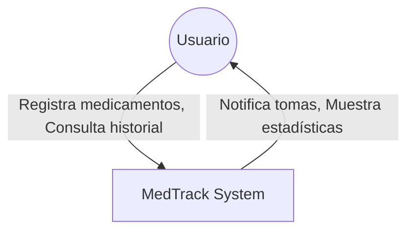

# Documentación de Arquitectura MedTrack (ARC42)

## 1. Introducción y Metas

### 1.1. Resumen
MedTrack es un sistema diseñado para ayudar a los usuarios a llevar un control preciso de su medicación. Permite registrar medicamentos, dosis, frecuencias y notas, además de mantener un historial de cumplimiento.

### 1.2. Objetivos de Calidad
- **Usabilidad:** Interfaz intuitiva y fácil de usar para personas de todas las edades.
- **Disponibilidad:** El servicio debe estar disponible para registrar tomas en cualquier momento.
- **Portabilidad:** La aplicación móvil debe funcionar en dispositivos Android (y potencialmente iOS).
- **Seguridad:** Los datos de salud del usuario deben estar protegidos.

### 1.3. Stakeholders
- **Usuarios Finales:** Pacientes que necesitan controlar su medicación.
- **Desarrolladores:** Equipo encargado del mantenimiento y evolución del sistema.
- **Administradores del Sistema:** Encargados del despliegue y monitoreo del backend.

## 2. Restricciones de Arquitectura
- **Tecnología Backend:** Node.js con Express.
- **Base de Datos:** PostgreSQL.
- **Tecnología Móvil:** Flutter (Dart).
- **Comunicación:** REST API sobre HTTP/HTTPS.
- **Despliegue:** Contenedores Docker para la base de datos.

## 3. Contexto y Alcance

### 3.1. Contexto de Negocio
El sistema MedTrack opera como una solución independiente para usuarios individuales.

**Diagrama de Contexto (C4 Nivel 1):**


### 3.2. Contexto Técnico
- **Cliente:** App Móvil (Flutter).
- **Servidor:** API REST (Node.js) expuesta en el puerto 3000.
- **Base de Datos:** PostgreSQL en el puerto 5432.

## 4. Estrategia de Solución
Se ha optado por una arquitectura cliente-servidor clásica:
- **Frontend:** Aplicación móvil nativa compilada con Flutter para ofrecer una experiencia fluida.
- **Backend:** API RESTful ligera en Node.js que gestiona la lógica de negocio y la persistencia.
- **Persistencia:** Base de datos relacional PostgreSQL para garantizar la integridad de los datos médicos.

## 5. Vista de Bloques

### 5.1. Nivel 1: Sistema General
Ver Diagrama de Contexto en la sección 3.

### 5.2. Nivel 2: Contenedores
```mermaid
graph TD
    User((Usuario))
    MobileApp[App Móvil (Flutter)]
    APIServer[API Backend (Node.js/Express)]
    Database[(Base de Datos PostgreSQL)]

    User -->|Usa| MobileApp
    MobileApp -->|HTTPS / JSON| APIServer
    APIServer -->|SQL / TCP| Database
```

### 5.3. Nivel 3: Componentes

#### Backend
- **Auth Controller:** Gestiona login y registro (JWT).
- **Medicamentos Controller:** CRUD de medicamentos.
- **Tomas Controller:** Registro de tomas realizadas.
- **Historial Controller:** Consultas agregadas.

#### Frontend
- **Auth Service:** Gestión de tokens y sesión.
- **Medication Service:** Comunicación con API de medicamentos.
- **Screens:** Login, Registro, Home (Lista), Agregar Medicamento.
- **Providers:** Gestión de estado (ChangeNotifier).

## 6. Vista en Tiempo de Ejecución

### 6.1. Escenario: Inicio de Sesión
1. Usuario introduce credenciales en `LoginScreen`.
2. `AuthService` envía POST `/auth/login` al Backend.
3. Backend verifica credenciales en DB.
4. Si es correcto, Backend retorna JWT.
5. `AuthService` guarda JWT en `SharedPreferences`.
6. App navega a `HomeScreen`.

### 6.2. Escenario: Agregar Medicamento
1. Usuario rellena formulario en `AddMedicationScreen`.
2. `MedicationService` envía POST `/medicamentos` con el token JWT.
3. Backend valida token y datos.
4. Backend inserta en DB.
5. Backend retorna el medicamento creado.
6. App actualiza la lista local y muestra el nuevo medicamento.

## 7. Vista de Despliegue
- **Entorno de Desarrollo:**
  - PC Desarrollador (Windows/Linux/Mac).
  - Docker Desktop (para PostgreSQL).
  - Android Emulator / Dispositivo Físico.
  - Node.js Runtime local.

## 8. Conceptos Transversales (Cross-cutting)
- **Seguridad:** Autenticación vía JWT (JSON Web Tokens). Contraseñas hasheadas (bcrypt).
- **Manejo de Errores:** Códigos HTTP estándar (200, 201, 400, 401, 500). Mensajes de error amigables en UI.
- **Internacionalización:** Interfaz en Español (hardcoded por ahora, extensible).
- **Persistencia UI:** `SharedPreferences` para mantener sesión.

## 9. Decisiones de Diseño
- **Flutter vs Nativo:** Se eligió Flutter para permitir futuro soporte iOS con el mismo código base.
- **Node.js:** Se eligió por la familiaridad con JavaScript y el ecosistema npm.
- **PostgreSQL:** Base de datos robusta y open source, ideal para datos estructurados.

## 10. Requerimientos de Calidad
- **Fiabilidad:** Los datos no deben perderse.
- **Performance:** Las respuestas de la API deben ser < 200ms en condiciones normales.

## 11. Riesgos y Deuda Técnica
- **Validación de Datos:** Actualmente básica en el frontend.
- **Tests:** Cobertura de tests unitarios y de integración es baja.
- **Hardcoding:** URLs de API (10.0.2.2) hardcodeadas para emulador Android.

## 12. Glosario
- **JWT:** JSON Web Token, estándar para compartir información de seguridad.
- **CRUD:** Create, Read, Update, Delete.
- **Toma:** Acción de ingerir un medicamento en un momento dado.
