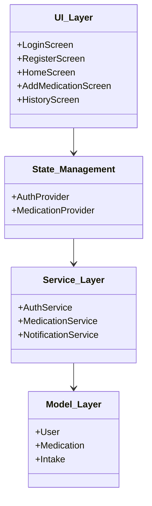
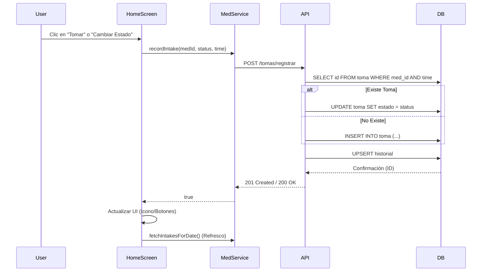
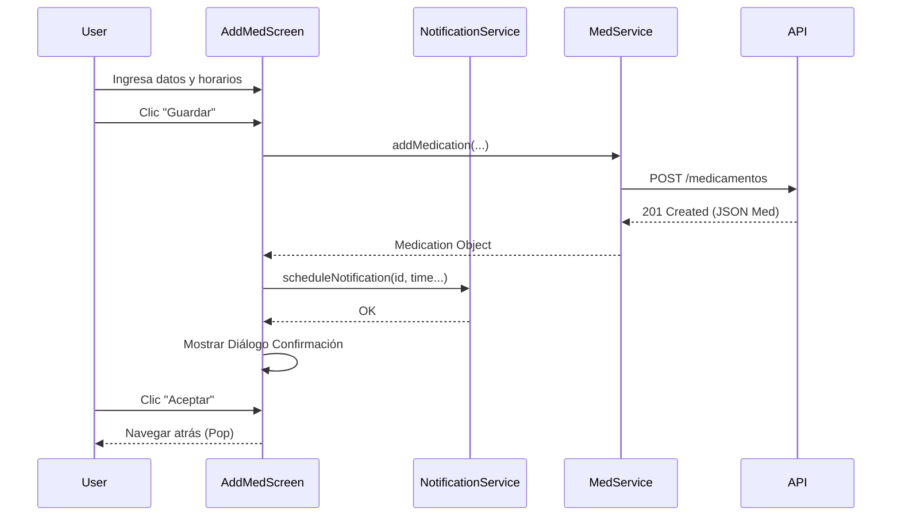

# Documentación de Arquitectura MedTrack (ARC42)

## 1. Introducción y Metas

### 1.1. Resumen
MedTrack es una solución integral para la gestión y seguimiento de tratamientos médicos personales. El sistema permite a los usuarios registrar sus medicamentos, configurar recordatorios personalizados (frecuencia diaria o días específicos), registrar la toma de medicamentos (confirmar u omitir) y visualizar su historial de cumplimiento.

### 1.2. Objetivos de Calidad
Los principales objetivos de calidad para la arquitectura son:

1.  **Usabilidad:** La interfaz de usuario debe ser moderna (Material 3), intuitiva y minimizar el número de pasos para registrar una toma.
2.  **Fiabilidad:** El sistema debe garantizar la persistencia de los datos de salud y la correcta programación de notificaciones locales exactas.
3.  **Rendimiento:** Tiempos de respuesta de la API inferiores a 200ms y fluidez en la aplicación móvil (60fps).
4.  **Mantenibilidad:** Código estructurado en capas claras (Frontend: Provider/Services, Backend: Controllers/Routes) y libre de comentarios redundantes.
5.  **Seguridad:** Protección de datos de usuario mediante autenticación JWT y almacenamiento seguro de credenciales.

### 1.3. Stakeholders
| Rol | Expectativa |
| :--- | :--- |
| **Usuario Final** | Registrar medicamentos fácilmente, recibir recordatorios puntuales y ver su progreso. |
| **Equipo de Desarrollo** | Arquitectura clara, código documentado y facilidad para añadir nuevas funcionalidades. |
| **Soporte Técnico** | Capacidad para diagnosticar problemas de sincronización o notificaciones. |

## 2. Restricciones de Arquitectura

*   **Frontend:** Framework Flutter (Dart) con Material 3 Design.
*   **Backend:** Node.js con Express.
*   **Base de Datos:** PostgreSQL (Relacional).
*   **Comunicación:** API REST sobre HTTP/HTTPS (JSON).
*   **Autenticación:** JWT (JSON Web Tokens).
*   **Permisos Android:** Requiere `SCHEDULE_EXACT_ALARM` para notificaciones precisas.

## 3. Contexto y Alcance

### 3.1. Contexto de Negocio
MedTrack se sitúa como un asistente personal de salud.

**Diagrama de Contexto (C4 Nivel 1):**

```mermaid
graph TD
    User((Usuario Paciente))
    System[Sistema MedTrack]
    EmailSys[Sistema de Correo (Futuro)]
    
    User -->|Registra tomas, Gestiona medicamentos| System
    System -->|Envía notificaciones push locales| User
    System -.->|Envía correos de recuperación| EmailSys
```

### 3.2. Contexto Técnico
El sistema se compone de una aplicación móvil que consume servicios de una API REST centralizada.

| Interfaz | Protocolo | Formato | Descripción |
| :--- | :--- | :--- | :--- |
| App <-> API | HTTP/1.1 | JSON | Comunicación RESTful para sincronización de datos. |
| App <-> Local | N/A | SQLite/Prefs | Almacenamiento local de sesión y preferencias. |

## 4. Estrategia de Solución

La arquitectura sigue el patrón **Cliente-Servidor** con una separación clara de responsabilidades:

*   **Frontend (Flutter):** Implementa el patrón **Provider** para la gestión de estado. Se separa la lógica de UI (Screens/Widgets) de la lógica de negocio (Services/Models).
*   **Backend (Node.js):** Arquitectura en capas (Rutas -> Controladores -> Modelos/Consultas).
*   **Persistencia:** Base de datos relacional normalizada para asegurar integridad referencial entre Usuarios, Medicamentos y Tomas.

## 5. Vista de Bloques

### 5.1. Nivel 2: Contenedores

```mermaid
graph TD
    subgraph Cliente
        App[App Móvil (Flutter)]
        LocalDB[(SharedPreferences / Local Storage)]
    end

    subgraph Servidor
        API[API REST (Node.js/Express)]
        DB[(PostgreSQL)]
    end

    App -->|HTTPS / JSON| API
    App -->|Lee/Escribe| LocalDB
    API -->|SQL / TCP| DB
```

### 5.2. Nivel 3: Componentes - App Móvil



### 5.3. Nivel 3: Componentes - Backend

*   **Routes (`/routes`):** Definición de endpoints (`auth.js`, `medicamentos.js`, `tomas.js`).
*   **Controllers (`/controllers`):** Lógica de negocio y orquestación.
    *   `authController`: Login, Registro.
    *   `medicamentosController`: CRUD Medicamentos, manejo de frecuencias complejas.
    *   `tomasController`: Registro de historial con lógica UPSERT (Evita duplicados).
*   **Database (`/config/db.js`):** Conexión y pool de conexiones a PostgreSQL.

## 6. Vista en Tiempo de Ejecución

### 6.1. Escenario: Registro/Actualización de Toma
El usuario marca un medicamento como "Tomado" o cambia su estado de "Omitido" a "Tomado".



### 6.2. Escenario: Creación de Medicamento con Recordatorios
El usuario crea un nuevo medicamento con frecuencia diaria.



## 7. Vista de Despliegue

El entorno actual es de desarrollo local, simulando un entorno de producción.

*   **Nodo 1: Dispositivo Móvil / Emulador**
    *   Ejecuta la APK de Flutter (Debug/Release).
    *   IP Típica (Emulador Android): `10.0.2.2` para acceder al host.
*   **Nodo 2: Servidor Host (Dev Machine)**
    *   Node.js Runtime (Puerto 3000).
    *   Contenedor Docker PostgreSQL (Puerto 5432).

## 8. Conceptos Transversales (Cross-cutting)

### 8.1. Modelo de Dominio y Persistencia
*   **Medicamento:** Entidad central. Contiene campo JSONB `detalles_frecuencia` para flexibilidad (días específicos, múltiples horas).
*   **Toma (Intake):** Registro inmutable de un evento. Relaciona Medicamento, Fecha Real, Fecha Programada y Estado (TOMADO/OMITIDO/PENDIENTE/ATRASADO).

### 8.2. Internacionalización (i18n)
*   Uso de `flutter_localizations` y `intl`.
*   Configuración regional 'es' (Español) por defecto para formatos de fecha y hora.

### 8.3. Manejo de Errores
*   **Backend:** Middleware de manejo de errores global. Respuestas JSON consistentes `{ "error": "mensaje" }`.
*   **Frontend:** `ScaffoldMessenger` para Feedback visual (Snackbars) ante fallos de red o validación.
*   **Permisos:** Manejo de excepciones para `exact_alarms_not_permitted` en Android 12+.

## 9. Decisiones de Diseño

| Decisión | Justificación | Alternativas Descartadas |
| :--- | :--- | :--- |
| **JSONB en PostgreSQL** | Permite almacenar configuraciones de frecuencia complejas y variables sin complicar el esquema relacional con múltiples tablas de unión para horarios. | Tabla `horarios_medicamento` (mayor complejidad de joins). |
| **Provider (Flutter)** | Solución estándar, ligera y suficiente para la complejidad actual de la app. | BLoC (demasiado boilerplate), Riverpod (curva de aprendizaje mayor). |
| **Notificaciones Locales Exactas** | Se requiere precisión en la hora de la toma médica. Se usan alarmas exactas de Android. | WorkManager (menos preciso), FCM (excesivo para local). |

## 10. Requerimientos de Calidad (Escenarios)

*   **ATAM-1 (Disponibilidad):** Si el backend no responde, la app debe mostrar un mensaje de error claro y permitir reintentar, manteniendo la sesión activa localmente.
*   **ATAM-2 (Modificabilidad):** Añadir un nuevo tipo de frecuencia (ej. "cada X horas") solo debe requerir cambios en el widget de selección y en la estructura JSON, sin alterar la tabla de base de datos.

## 11. Riesgos y Deuda Técnica

*   **Validación de Datos Backend:** La validación actual en el backend es básica. Se recomienda implementar una librería como `Joi` o `express-validator`.
*   **Seguridad de Token:** El JWT se almacena en `SharedPreferences` sin encriptación adicional. En producción, usar `flutter_secure_storage`.
*   **Testing:** Cobertura de pruebas unitarias y de integración es nula actualmente. Riesgo de regresión en refactorizaciones.
*   **Políticas de Google Play:** El uso del permiso `SCHEDULE_EXACT_ALARM` requiere justificación al publicar en la tienda.

## 12. Glosario

*   **Intake (Toma):** Acción de ingerir el medicamento.
*   **Schedule (Agenda):** Lista ordenada de tomas programadas para un día.
*   **JSONB:** Binary JSON, tipo de dato de PostgreSQL para documentos JSON indexables.
*   **Widget:** Componente visual básico en Flutter.
*   **Upsert:** Operación de base de datos que actualiza un registro si existe, o lo inserta si no.
*   **Material 3:** Última versión del sistema de diseño de Google, enfocado en personalización y accesibilidad.
*   **JWT:** JSON Web Token, estándar para compartir información de seguridad entre cliente y servidor.
