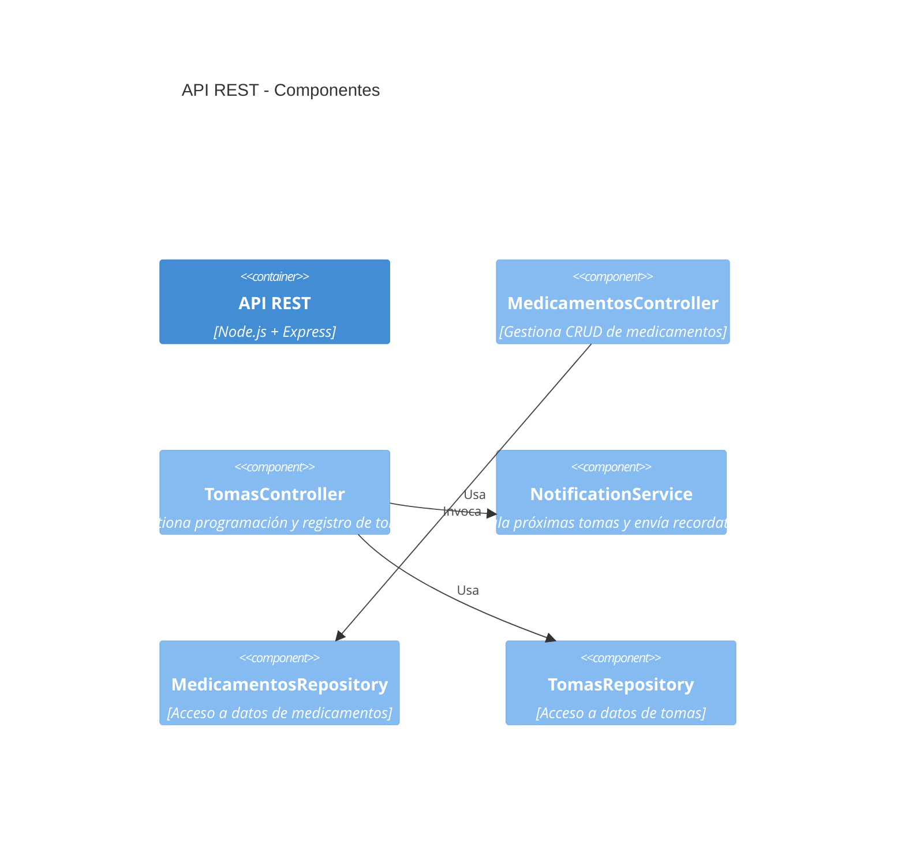

```mermaid
C4Component
title API REST - Componentes

Container(api, "API REST", "Node.js + Express")

Component(controllerMed, "MedicamentosController", "Gestiona CRUD de medicamentos")
Component(controllerTomas, "TomasController", "Gestiona programación y registro de tomas")
Component(serviceNotif, "NotificationService", "Calcula próximas tomas y envía recordatorios")
Component(repoMed, "MedicamentosRepository", "Acceso a datos de medicamentos")
Component(repoTomas, "TomasRepository", "Acceso a datos de tomas")

Rel(controllerMed, repoMed, "Usa")
Rel(controllerTomas, repoTomas, "Usa")
Rel(controllerTomas, serviceNotif, "Invoca")
```