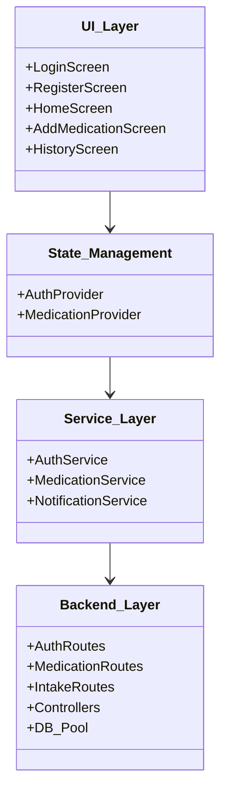

```mermaid
classDiagram
    class UI_Layer {
        +LoginScreen
        +RegisterScreen
        +HomeScreen
        +AddMedicationScreen
        +HistoryScreen
    }
    class State_Management {
        +AuthProvider
        +MedicationProvider
    }
    class Service_Layer {
        +AuthService
        +MedicationService
        +NotificationService
    }
    class Backend_Layer {
        +AuthRoutes
        +MedicationRoutes
        +IntakeRoutes
        +Controllers
        +DB_Pool
    }

    UI_Layer --> State_Management
    State_Management --> Service_Layer
    Service_Layer --> Backend_Layer
```
