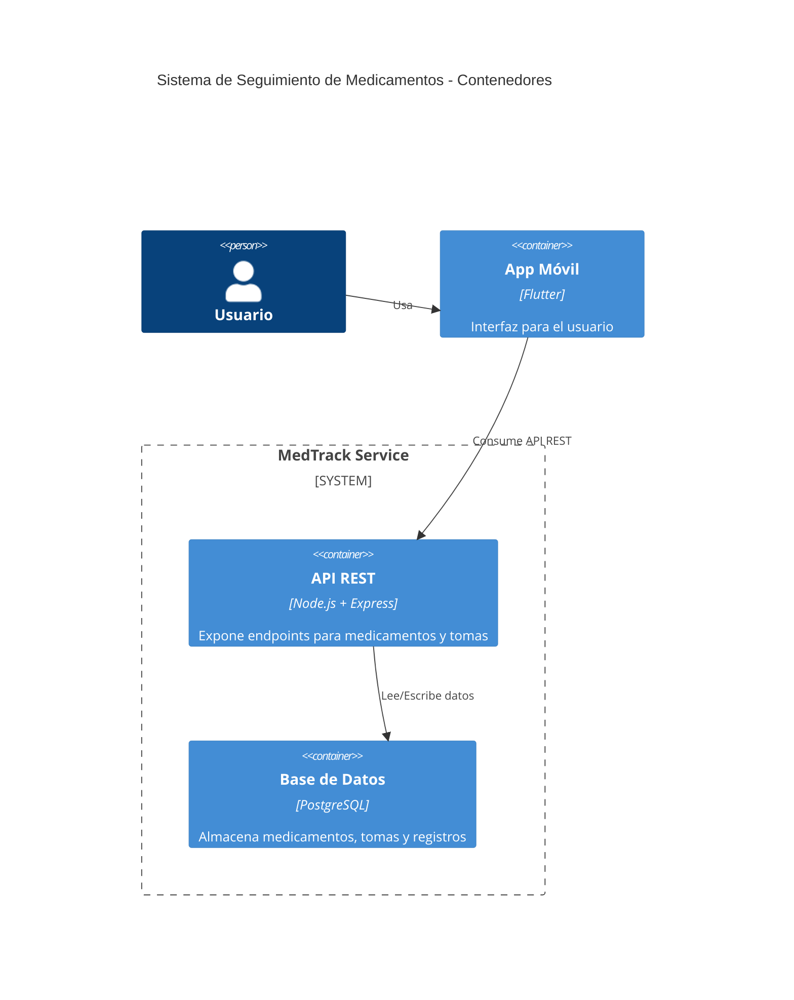

```mermaid
C4Container
title Sistema de Seguimiento de Medicamentos - Contenedores

Person(usuario, "Usuario")

System_Boundary(medtrack, "MedTrack Service") {
  Container(api, "API REST", "Node.js + Express", "Expone endpoints para medicamentos y tomas")
  Container(db, "Base de Datos", "PostgreSQL", "Almacena medicamentos, tomas y registros")
}

Container(movil, "App Móvil", "Flutter", "Interfaz para el usuario")

Rel(usuario, movil, "Usa")
Rel(movil, api, "Consume API REST")
Rel(api, db, "Lee/Escribe datos")
```