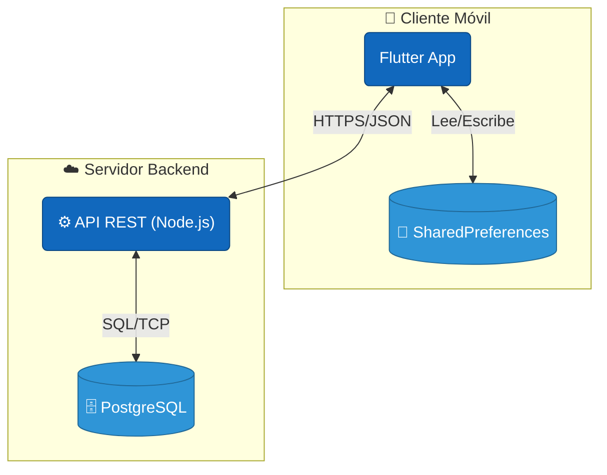

```mermaid
flowchart TB
    subgraph Client [📱 Cliente Móvil]
        direction TB
        App("Flutter App")
        LocalDB[("💾 SharedPreferences")]
    end

    subgraph Backend [☁️ Servidor Backend]
        direction TB
        API("⚙️ API REST (Node.js)")
        DB[("🗄️ PostgreSQL")]
    end

    App <-->|HTTPS/JSON| API
    App <-->|Lee/Escribe| LocalDB
    API <-->|SQL/TCP| DB

    style App fill:#1168bd,stroke:#0b4884,color:#fff
    style API fill:#1168bd,stroke:#0b4884,color:#fff
    style LocalDB fill:#2f95d7,stroke:#206897,color:#fff
    style DB fill:#2f95d7,stroke:#206897,color:#fff
```
