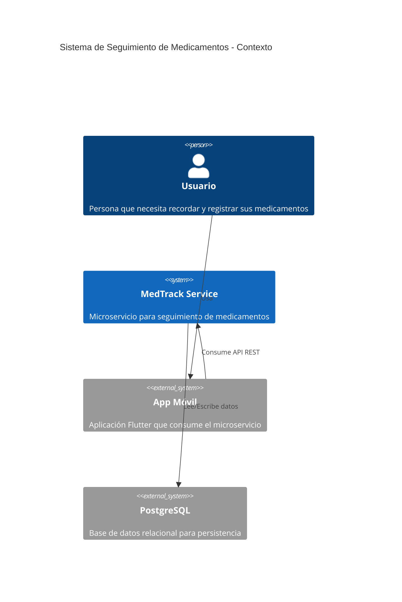

```mermaid
C4Context
title Sistema de Seguimiento de Medicamentos - Contexto

Person(usuario, "Usuario", "Persona que necesita recordar y registrar sus medicamentos")
System(systema, "MedTrack Service", "Microservicio para seguimiento de medicamentos")

System_Ext(movil, "App Móvil", "Aplicación Flutter que consume el microservicio")
System_Ext(db, "PostgreSQL", "Base de datos relacional para persistencia")

Rel(usuario, movil, "Usa")
Rel(movil, systema, "Consume API REST")
Rel(systema, db, "Lee/Escribe datos")
```