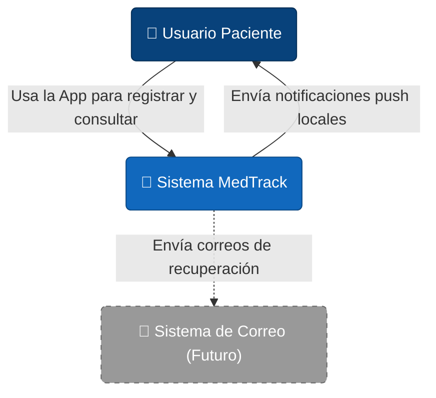

```mermaid
flowchart TB
    User("👤 Usuario Paciente")
    System("📱 Sistema MedTrack")
    EmailSys("📧 Sistema de Correo (Futuro)")

    User -->|Usa la App para registrar y consultar| System
    System -->|Envía notificaciones push locales| User
    System -.->|Envía correos de recuperación| EmailSys
    
    style User fill:#08427b,stroke:#052e56,color:#fff
    style System fill:#1168bd,stroke:#0b4884,color:#fff
    style EmailSys fill:#999999,stroke:#666666,color:#fff,stroke-dasharray: 5 5
```
