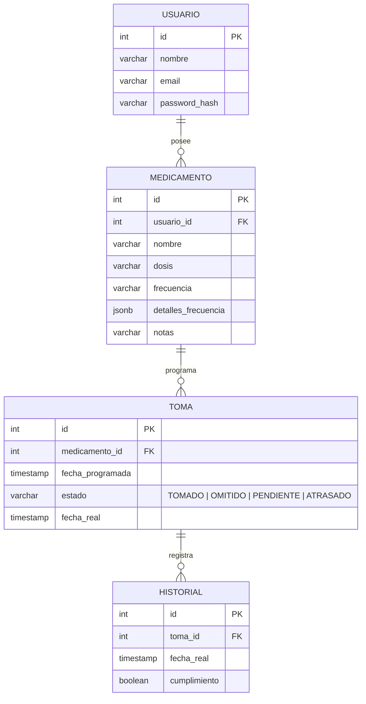

# Modelo de dominio (ERD)

```mermaid
erDiagram
    USUARIO {
        int id PK
        varchar nombre
        varchar email
        varchar password_hash
    }

    MEDICAMENTO {
        int id PK
        int usuario_id FK
        varchar nombre
        varchar dosis
        varchar frecuencia
        jsonb detalles_frecuencia
        varchar notas
    }

    TOMA {
        int id PK
        int medicamento_id FK
        timestamp fecha_programada
        varchar estado "TOMADO | OMITIDO | PENDIENTE | ATRASADO"
        timestamp fecha_real
    }

    HISTORIAL {
        int id PK
        int toma_id FK
        timestamp fecha_real
        boolean cumplimiento
    }

    USUARIO ||--o{ MEDICAMENTO : "posee"
    MEDICAMENTO ||--o{ TOMA : "programa"
    TOMA ||--o{ HISTORIAL : "registra"
```
